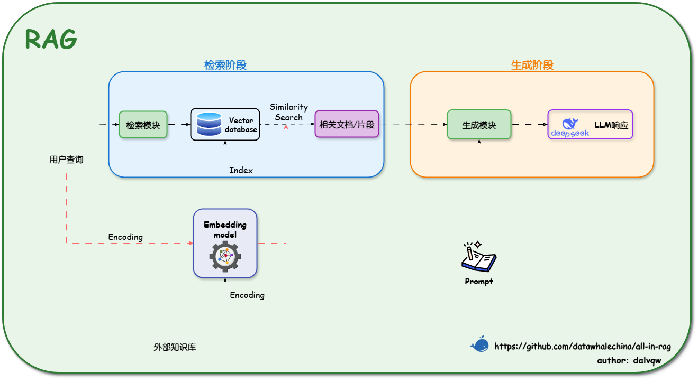

# FinRAG-Advisor: 智能投顾与合规双模 RAG 系统

基于多模态知识图谱增强的智能投顾与合规审查系统，一个面向金融机构的 RAG 知识库系统 built with [LangChain](https://www.langchain.com/)、[DeepSeek](https://platform.deepseek.com/) 和 [Elasticsearch](https://github.com/elastic/elasticsearch)。

该系统不仅支持客户与员工的自然语言问答，而且深入融合了投资建议生成与合规风险自动校验，实现智能服务 + 自动合规审查一体化。




## 核心特性

### 双 RAG 子系统
- **投资建议生成**：基于检索增强的智能问答
- **合规验证**：对投资建议进行实时审计，降低幻觉风险

### 多模态知识图谱增强
- 年报、报表、图片通过 OCR/多模态大模型结构化解析
- 转化为知识三元组，构建动态金融知识图谱

### 实时监管政策
- 接入央行、证监会等 RSS 源
- 自动抓取最新政策并更新知识库

### 混合检索
- **语义检索**：BGE-M3 向量模型
- **关键词检索**：Elasticsearch
- **知识图谱检索**：Neo4j 图数据库
- **RRF 融合**：三种检索结果融合排序

### 智能文档处理
- PDF 布局识别 (pdfplumber)
- 表格结构识别与还原
- 层级感知动态分块算法

### 锐思文本分析集成
- **LLM 自主决策调用**：大模型根据用户问题自主判断是否需要调用锐思 API
- **关键词触发**：同时支持关键词自动触发机制
- **7 类文本数据**：中国上市公司报告、政府工作报告、美国上市公司报告、财经资讯、研究报告、股吧评论、房产拍卖
- **RAG 知识库填充**：支持将锐思获取的文本数据直接注入向量数据库

### ML 量化策略
- **Walk-forward 滚动训练**：支持逻辑回归、XGBoost、LightGBM、随机森林、LSTM
- **热启动快照**：回测状态保存与恢复，支持增量回测
- **多策略模拟盘**：多 slot 策略配置、组合回测、跨策略风控指标

### 系统化评估
- RAGAS 框架评估
- 五大核心指标：faithfulness、context precision、answer relevance、response time、compliance coverage
- 可视化仪表盘展示

---

## 环境要求

- Python 3.10+
- Docker Desktop (用于运行 Elasticsearch 和 Neo4j)
- DeepSeek API Key (用于大模型对话)

---

## 安装说明

### 1. 获取 DeepSeek API Key

1. 访问 [DeepSeek 开放平台](https://platform.deepseek.com/)
2. 注册账号并获取 API Key
3. 在 `.env` 文件中配置 `DEEPSEEK_API_KEY=your_key`

> API Key 格式示例: `sk-xxxxxxxxxxxxxxxxxxxxxxxx`

### 2. 安装 Ollama（仅用于 Embedding 向量化）

本地运行需要安装 [Ollama](https://ollama.com/download) 来运行 Embedding 模型。

#### 拉取 Embedding 模型（用于文档向量化）

```bash
# 拉取 Embedding 模型（用于文档向量化）
ollama pull bge-m3
```

> **注意**：Embedding 模型使用 `bge-m3`（或手动导入时自定义的名字如 `my-bge-m3`），对话功能已切换到 DeepSeek API，无需再拉取对话模型。

### 3. 安装并启动 Docker 容器

#### 首次安装（只需执行一次）

```bash
# Elasticsearch
docker run -d \
    --name es-langchain \
    -p 9200:9200 -p 9300:9300 \
    -e discovery.type=single-node \
    -e xpack.security.enabled=false \
    -e "ES_JAVA_OPTS=-Xms512m -Xmx512m" \
    -v es-data:/usr/share/elasticsearch/data \
    docker.elastic.co/elasticsearch/elasticsearch:8.11.0

# Neo4j（可选）
docker run -d \
    --name neo4j-langchain \
    -p 7474:7474 -p 7687:7687 \
    -e NEO4J_AUTH=neo4j/password \
    -e NEO4J_PLUGINS='["apoc"]' \
    neo4j:5.15-community
```

#### 日常启动

```bash
docker start es-langchain
docker start neo4j-langchain  # 可选
```

### 4. 配置环境变量

创建 `.env` 文件：

```bash
DEEPSEEK_API_KEY=your_deepseek_api_key
DEEPSEEK_MODEL=deepseek-v4-pro
ES_LOCAL_URL=http://localhost:9200
EMBEDDING_MODEL=bge-m3
OLLAMA_BASE_URL=http://localhost:11434
NEO4J_URI=bolt://localhost:7687
NEO4J_USERNAME=neo4j
NEO4J_PASSWORD=password
```

### 5. 安装依赖

```bash
pip install -r requirements.txt
pip install https://rtas.resset.com/txtPath/resset-0.9.8-py3-none-any.whl  # 锐思文本分析（可选）
```

---

## 快速开始

### 方式一：脚本启动（推荐）

```bash
# 首次安装（只需执行一次）
install.bat

# 日常启动
start.bat
```

**install.bat** 会完成以下操作：
```
[1/4] 检查 Docker Desktop
[2/4] 清理旧容器（如果存在）
[3/4] 创建 Elasticsearch 容器
[4/4] 创建 Neo4j 容器（可选）
```

**start.bat** 会完成以下操作：
```
[1/6] 检查 Docker Desktop
[2/6] 检查环境变量配置
[3/6] 启动 Elasticsearch
[4/6] 启动 Neo4j（可选）
[5/6] 检查 Ollama Embedding 服务
[6/6] 清理 Python 缓存
[启动] Streamlit → http://localhost:8501
```

### 方式二：手动启动

```bash
ollama serve                   # 1. 启动 Ollama（仅 Embedding 模型）
docker start es-langchain      # 2. 启动 Elasticsearch
docker start neo4j-langchain   # 3. (可选) 启动 Neo4j
streamlit run src/streamlit_app.py  # 4. 启动 Web 界面
```

> **提示**：遇到 `KeyError: 'src.rag'` 导入错误时，删除 `src/__pycache__` 目录后重试。

### 知识库数据导入（重要！）

RAG 智能问答功能依赖 Elasticsearch 中的向量索引 `rag-langchain`。**首次使用前必须导入文档数据**，否则会报错 `NotFoundError: no such index [rag-langchain]`。

#### 数据准备

将你的文档放入 `data/` 目录（支持 `.md` 和 `.pdf` 文件）：

```
data/
├── 01_金融法规/          # 金融法规 Markdown
├── 案例/                 # 案例
├── 民法商法/             # 法律条文
├── 司法解释/             # 司法解释
├── kg_docs/              # 知识图谱专用（可选）
└── *.pdf                 # PDF 文件也会自动处理
```

> **提示**：支持任意子目录结构，脚本会递归扫描所有文件。

#### 一键导入

运行内置的数据导入脚本：

```bash
# Windows
set PYTHONIOENCODING=utf-8 && python src/store_data.py

# Linux / macOS
python src/store_data.py
```

该脚本会：
1. 自动扫描 `data/` 下所有 `.md` 和 `.pdf` 文件
2. 使用 **docling** 解析 PDF、**RecursiveCharacterTextSplitter** 分块
3. 调用 Ollama Embedding 模型生成向量
4. 批量写入 Elasticsearch，创建 `rag-langchain` 索引

#### 常见问题

| 问题 | 解决方案 |
|------|---------|
| `ModuleNotFoundError: No module named 'docling'` | 先安装依赖：`pip install docling` |
| `UnicodeEncodeError: 'charmap' codec can't encode` | Windows 需设置编码：`set PYTHONIOENCODING=utf-8` |
| `NotFoundError: no such index [rag-langchain]` | 说明未执行过数据导入，按上方步骤操作即可 |

---

## 系统架构

```
┌──────────────────────────────────────────────────────────────────────────┐
│                         FinRAG-Advisor 系统架构                          │
├──────────────────────────────────────────────────────────────────────────┤
│                                                                          │
│  ┌───────────────────────────────────────────────────────────────────┐  │
│  │                      用户界面层 (Streamlit 6 页)                    │  │
│  │  ┌────────┐ ┌────────┐ ┌──────┐ ┌────────┐ ┌──────┐ ┌──────┐    │  │
│  │  │  CHAT  │ │ MARKET │ │  KG  │ │ RESSET │ │ QUANT │ │ EVAL │    │  │
│  │  │智能问答│ │行情数据│ │知识图谱│ │文本分析│ │量化回测│ │  评估  │    │  │
│  │  └────────┘ └────────┘ └──────┘ └────────┘ └──────┘ └──────┘    │  │
│  └───────────────────────────────────────────────────────────────────┘  │
│                                    │                                    │
│  ┌─────────────────────────────────┴─────────────────────────────────┐  │
│  │                  业务逻辑层 (LangChain / LangGraph)                 │  │
│  │  ┌──────────┐ ┌──────────┐ ┌──────────┐ ┌──────────┐             │  │
│  │  │ 意图分类 │ │ RAG 检索  │ │ 合规审查 │ │ 触发系统 │             │  │
│  │  └──────────┘ └──────────┘ └──────────┘ └──────────┘             │  │
│  │  ┌──────────┐ ┌──────────┐ ┌──────────┐ ┌──────────┐             │  │
│  │  │ ML 策略  │ │  多策略  │ │ 快照管理 │ │ 锐思API  │             │  │
│  │  │ Walk-Fwd │ │  模拟盘  │ │ 热启动   │ │ LLM调用  │             │  │
│  │  └──────────┘ └──────────┘ └──────────┘ └──────────┘             │  │
│  └───────────────────────────────────────────────────────────────────┘  │
│          │                    │                    │                     │
│  ┌───────┴────────────────────┴────────────────────┴───────────┐       │
│  │                          数据层                              │       │
│  │  ┌─────────────┐  ┌─────────┐  ┌─────────┐  ┌──────────┐   │       │
│  │  │Elasticsearch│  │  Neo4j  │  │ AKShare │  │  RESSET  │   │       │
│  │  │  向量存储   │  │ 知识图谱│  │ 金融数据│  │ 文本分析 │   │       │
│  │  └─────────────┘  └─────────┘  └─────────┘  └──────────┘   │       │
│  └─────────────────────────────────────────────────────────────┘       │
│                                    │                                     │
│  ┌─────────────────────────────────┴─────────────────────────────┐     │
│  │                    模型层                                      │     │
│  │  ┌──────────────────────────┐    ┌─────────────────────────┐ │     │
│  │  │    bge-m3 (Ollama)         │    │   DeepSeek API          │ │     │
│  │  │   (Embedding 本地)       │    │    (对话生成 - 远程)    │ │     │
│  │  └──────────────────────────┘    └─────────────────────────┘ │     │
│  └─────────────────────────────────────────────────────────────┘     │
│                                                                        │
└────────────────────────────────────────────────────────────────────────┘
```

---

## 功能模块详解

### CHAT - 智能问答

基于 RAG 的智能对话，支持多种数据来源自动补充：

| 触发方式 | 数据来源 | 说明 |
|---------|---------|------|
| 关键词匹配 | 金融数据 (AKShare) | 股价、基金、经济指标等实时数据 |
| 关键词 + LLM 决策 | 锐思文本分析 (RESSET) | 年报、政府报告、研报、股评等 |
| 关键词匹配 | ML 策略信息 | 机器学习策略说明、热启动快照 |
| 知识图谱 | Neo4j | 公司关系、行业图谱检索 |

**LLM 自主决策调用锐思 API**：
当用户提问涉及年报、政府报告、研报等内容时，大模型会自动判断并调用锐思 API 获取数据。例如：
- "帮我看看万科2023年的年报" → 自动获取万科A年度报告
- "国务院2023年政府工作报告说了什么" → 自动获取政府工作报告
- "亚马逊的10K报告" → 自动获取美股10-K报告

### MARKET - 行情数据

- K线图、均线、MACD、RSI 等技术指标可视化
- 支持 AKShare 实时股票数据

### KG - 知识图谱

- Neo4j 图数据库可视化
- 公司-人员-行业关系查询
- 多跳推理

### RESSET - 锐思文本分析

| 子功能 | 说明 |
|--------|------|
| 中国上市公司 | 年度报告、季度报告、问询函、招股说明书等 13 种类型 |
| 政府工作报告 | 国务院、31个省市区的政府工作报告 |
| 美国上市公司 | 10K年报、10Q季报、424B招股说明书 |
| 资讯/研究/股吧 | 财经新闻、研究报告、东方财富/雪球股评、房产拍卖 |
| **RAG 知识库填充** | 将锐思获取的文本数据注入 Elasticsearch 向量数据库 |

### QUANT - 量化回测

| 子功能 | 说明 |
|--------|------|
| 规则策略 | 双均线、RSI、MACD、布林带 |
| ML 策略 | 逻辑回归、XGBoost、LightGBM、随机森林、LSTM |
| Walk-forward | 滚动训练窗口，支持特征工程配置 |
| 快照管理 | 回测状态保存、热启动恢复 |
| 多策略模拟盘 | 多 slot 策略组合、跨策略风控指标 |
| 基准对比 | 支持与市场基准收益率对比 |

### EVAL - RAG 评估

- RAGAS 框架评估：Faithfulness、Context Precision、Answer Relevance
- 可视化仪表盘展示

---

## 项目结构

```
langchain-ollama-elasticsearch/
│
├── data/                       # 文档目录（金融法规等 .md 文件）
├── src/                        # 源代码目录
│   ├── __init__.py             # 包初始化
│   ├── streamlit_app.py        # Streamlit 主应用（6 页面）
│   ├── rag.py                  # RAG 检索与生成 + 锐思工具调用 + 数据填充
│   ├── knowledge_graph.py      # 知识图谱 (Neo4j)
│   ├── intent_classifier.py    # 意图分类
│   ├── quantitative.py         # 量化回测引擎（规则策略）
│   ├── ml_strategy.py          # ML 策略工厂（Walk-forward）
│   ├── multi_strategy.py       # 多策略模拟盘
│   ├── snapshot_manager.py     # 热启动快照管理
│   ├── resset_data.py          # 锐思文本分析 API 封装
│   ├── finance_data.py         # 金融数据 (AKShare)
│   ├── finance_trigger.py      # 金融数据触发器
│   ├── trigger_system.py       # 统一触发系统
│   ├── evaluator.py            # RAG 评估器 (RAGAS)
│   ├── reporter.py             # 评估报告
│   ├── compliance_checker.py   # 合规审查
│   ├── auth.py                 # 用户认证
│   ├── onboarding.py           # 新手引导
│   └── config.py               # 配置管理
│
├── scripts/                    # 脚本目录
├── requirements.txt            # Python 依赖
├── .env                        # 环境变量配置
├── install.bat                 # 首次安装脚本（创建 Docker 容器）
└── start.bat                  # 日常启动脚本
```

---

## 技术栈

| 组件 | 技术 | 说明 |
|:-----|:-----|:-----|
| LLM | DeepSeek v4-pro/v4-flash | 远程大模型 API |
| Embedding | BGE-M3 | 文本向量化 |
| 向量数据库 | Elasticsearch 8.11 | 文档存储与检索 |
| 知识图谱 | Neo4j 5.15 | 图数据库 |
| 金融数据 | AKShare | 免费金融数据接口 |
| 文本分析 | RESSET (锐思) | 金融文本分析 API |
| 量化框架 | 自研量化模块 | 规则/ML 策略 + Walk-forward 回测 |
| ML 框架 | scikit-learn / XGBoost / PyTorch | 机器学习策略 |
| RAG 框架 | LangChain + LangGraph | 应用框架 |
| 评估框架 | RAGAS | RAG 系统评估 |
| Web UI | Streamlit | 前端界面 |
| 可视化 | Plotly | 图表展示 |

---

## 数据流示意

```
用户提问
  │
  ├─→ 意图分类 → 触发系统判断
  │     │
  │     ├─→ 金融关键词 → AKShare 实时数据注入
  │     ├─→ 年报/研报关键词 → 锐思 API 自动获取
  │     ├─→ ML 关键词 → 策略/快照信息注入
  │     └─→ 知识图谱 → Neo4j 检索
  │
  ├─→ 向量检索 (Elasticsearch)
  │     └─→ 相似度过滤 + Reranker 精排
  │
  ├─→ Prompt 组装
  │     ├─ 检索文档 + 金融数据 + 锐思数据
  │     └─ 锐思工具描述（LLM 可自主调用）
  │
  ├─→ LLM 生成回答
  │     └─→ 检测 [RESSET_CALL:...] 标记 → 调用 API → 补充数据
  │
  └─→ 合规审查 → 最终回答
```

---

## Copyright

Copyright (C) 2026.
